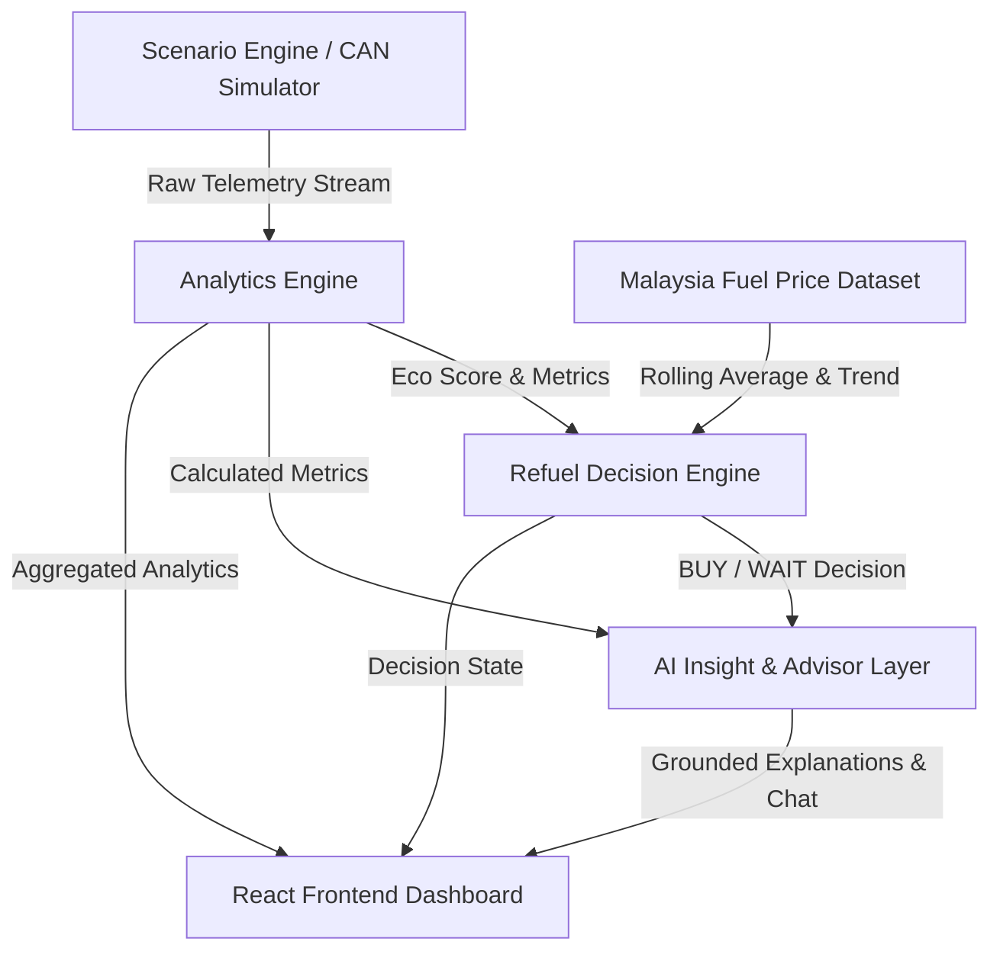

# FuelSense — Driving & Fuel Decision Intelligence System

FuelSense is a mobile-first decision intelligence system designed to transform raw vehicle behavior (telemetry data) and fuel price trends into clear, actionable financial and environmental insights. 

Instead of overwhelming drivers with abstract vehicle telemetry, FuelSense converts raw speed, RPM, and throttle cycles into concrete metrics, telling users exactly **when to refuel**, **how their driving behavior impacts their wallet**, and **how to reduce fuel waste and carbon emissions**.

---

## 🛠️ The Problems FuelSense Solves

1. **Strategic Refueling Inefficiency**: Drivers typically refuel reactively (e.g., when the low-fuel indicator lights up), missing price optimization windows. FuelSense helps drivers decide whether to **BUY** or **WAIT** based on historical price trends and rolling averages.
2. **Invisible Fuel Consumption Costs**: Acceleration spikes, prolonged idling, and traffic congestion waste money in ways that drivers cannot easily quantify. FuelSense translates telemetry into an intuitive **Eco Score** and a direct cost-per-kilometer index (RM/km).
3. **Unaware Carbon Impact**: Most drivers do not know the direct correlation between their driving patterns and CO₂ emissions. FuelSense bridges this gap by estimating environmental impact dynamically per driving session.
4. **Abstract Dashboard Metrics**: Traditional car dashboards present raw RPM and fuel gauges without actionable recommendations. FuelSense leverages an **AI Advisor** to translate metrics into clear, step-by-step instructions.

---

## 🏗️ Architecture & Core Philosophy

FuelSense operates on a **Deterministic Core + AI Explanation Layer** model. AI is strictly prohibited from calculating telemetry metrics or refueling decisions. Instead:
- **Telemetry & Physics Calculation**: Deterministic backend mathematics.
- **Refueling Decisions**: Rules-based engine utilizing real market datasets.
- **AI Layer (DeepSeek-V4)**: Summarizes and explains the results to the user in a natural, conversational tone.

### System Data Flow



---

## 🗂️ Project Structure

The project is structured into a Python FastAPI backend and a React (Vite) frontend:

```text
FuelSenseSim/
├── backend/
│   ├── main.py                 # FastAPI application entrypoint & middleware configuration
│   ├── database.py             # SQLite connection and session settings
│   ├── models.py               # SQLAlchemy schema definitions for telemetry/runs
│   ├── schemas.py              # Pydantic data contract models
│   ├── routers/
│   │   ├── scenarios.py        # Scenario initialization, list, status, and state endpoints
│   │   ├── simulate.py         # Batch simulation run trigger API
│   │   ├── analytics.py        # Analytics retrieval endpoints
│   │   ├── refuel.py           # Refueling advisor state endpoints
│   │   └── ai.py               # AI Chat interface endpoint
│   ├── services/
│   │   ├── analytics_engine.py # Physics formulas (efficiency L/100km, Eco Score)
│   │   ├── decision_engine.py  # Buy/Wait decision rules & low-fuel overrides
│   │   ├── fuel_price_service.py # Historic price tracking & trend analysis
│   │   └── ai_service.py       # DeepSeek client & local fallback templates
│   ├── simulation/
│   │   ├── can_generator.py    # Synthetic CAN-bus signal simulator
│   │   ├── scenario_definitions.py # Driving profiles (Economy, City, Aggressive, Highway)
│   │   └── scenario_engine.py  # Stream orchestrator, tick controller & lock manager
│   └── tests/
│       └── test_e2e.py         # End-to-end integration and mathematical verification tests
├── frontend/
│   ├── index.html              # Frontend entry HTML page
│   ├── package.json            # NPM dependencies & build scripts
│   ├── vite.config.js          # Vite compilation settings
│   └── src/
│       ├── main.jsx            # React app renderer
│       ├── App.jsx             # Main dashboard UI structure and polling loop
│       ├── App.css             # Main stylesheet & custom overrides
│       ├── index.css           # Premium Tailwind-inspired CSS styling sheet
│       └── components/
│           ├── EcoScoreGauge.jsx       # Custom circular arc gauge component
│           ├── RefuelDecisionCard.jsx  # Rich decision card (BUY/WAIT) with savings
│           ├── AIInsightPanel.jsx      # Cause, Effect, Action explanations
│           ├── AIChat.jsx              # Dynamic QA messaging panel with AI advisor
│           ├── BehaviorBreakdownBar.jsx # Visual breakdown of idle/city/highway ratios
│           ├── MetricCard.jsx          # Reusable display metric boxes (e.g. L/100km)
│           └── ScenarioFAB.jsx         # Floating control wheel to select driving profiles
└── docs/                       # Comprehensive product and system specifications
```

---

## ⚡ Key Modules & Intelligence Logics

### 1. Refueling Decision Matrix
The Refuel Decision Engine checks fuel status and price trends against Malaysia’s retail fuel pricing dataset:
- **Low Fuel Override (Hard Constraint)**: If fuel level drop is $< 15\%$, recommendation is forced to **BUY (Critical)** immediately.
- **Price Rising Trend**: If the fuel price is below the 30-day rolling average but trending **RISING**, recommendation is **BUY** to lock in lower rates.
- **Price Falling Trend**: If the price is trending **FALLING** and the vehicle fuel level is $> 40\%$, recommendation is **WAIT** to save on cost later.

### 2. Eco Score Engine
Eco Score (0-100) calculations penalize inefficient driving behavior:
$$\text{Eco Score} = 100 - \text{Idle Penalty} - \text{Aggressive Acceleration Penalty} - \text{Inefficiency Penalty}$$
- **Idle Penalty**: Assessed when the engine runs while the speed is 0 km/h.
- **Aggressive Acceleration Penalty**: Triggered by rapid throttle spikes ($> 60\%$) and high RPM surges.
- **Inefficiency Penalty**: Derived from high engine loads and poor fuel burn ratios.

### 3. Scenario Profiles (Simulated Telemetry Streams)
To ensure reliable presentation and testing without physical hardware, the system executes 4 distinct driving realities:
- **Economy Driver**: Stable speeds (40–70 km/h), minimal throttle, and optimal fuel burn.
- **Urban Congestion**: Stop-and-go pattern, high idling ratio ($30\%\text{--}45\%$), and high fuel waste.
- **Aggressive Driving**: Rapid speed surges (60–140 km/h), high throttle spikes, and heavy engine load.
- **Mixed Weekly Driving**: Standard, balanced distribution representing a typical driver profile.

---

## 🚀 Getting Started

### Prerequisites
- **Python**: 3.10 or higher
- **Node.js**: v18 or higher
- **OpenAI/DeepSeek API Key** (optional, fallback local templates will run if key is missing)

---

### Step 1: Run the Backend

1. Navigate to the project root and create a `.env` file:
   ```env
   DEEPSEEK_API_KEY=your_api_key_here
   DEEPSEEK_BASE_URL=https://api.deepseek.com
   ```
2. Set up a Python virtual environment and install the dependencies:
   ```powershell
   # Windows PowerShell
   python -m venv venv
   .\venv\Scripts\Activate.ps1
   pip install fastapi uvicorn sqlalchemy openai python-dotenv pytest
   ```
3. Launch the FastAPI server:
   ```powershell
   uvicorn backend.main:app --reload
   ```
   The backend will start at `http://127.0.0.1:8000`. You can inspect the interactive OpenAPI spec documentation at `http://127.0.0.1:8000/docs`.

---

### Step 2: Run the Frontend

1. Navigate to the `frontend` folder:
   ```powershell
   cd frontend
   ```
2. Install npm dependencies:
   ```powershell
   npm install
   ```
3. Run the development server:
   ```powershell
   npm run dev
   ```
   Open your browser and navigate to the local URL (usually `http://localhost:5173`) to view the interactive FuelSense Dashboard.

---

## 🧪 Automated Testing

FuelSense includes a complete end-to-end integration and mathematical test suite in [test_e2e.py](file:///c:/Users/User/Documents/trae_projects/FuelSenseSim/backend/tests/test_e2e.py) to verify API routing contracts, `SimulationState` schema integrity, physical calculations, and refuel decision logics.

To execute the tests:
```powershell
python -m pytest backend/tests/test_e2e.py -v
```

All 8 core tests cover:
- Scenario listing and set locks.
- Telemetry streaming status and snapshot state validations.
- Decision engine mathematical calculations.
- Analytics formula correctness (distance and consumption integrals).
