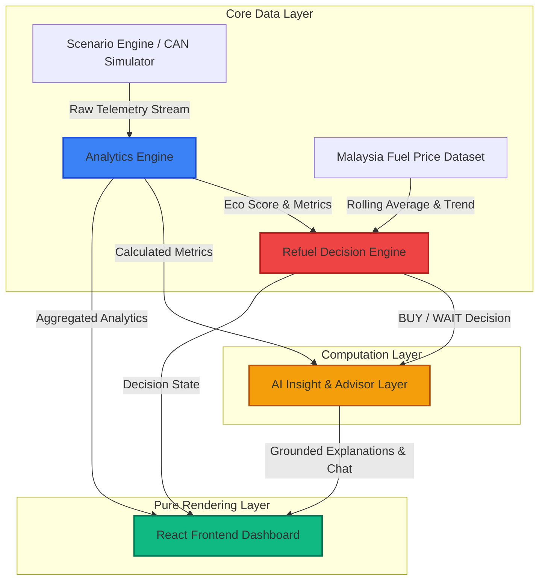

# FuelSense: Winning Vibeathon 2026 Under Self-Imposed Constraints

*A case study on building a real-time telemetry and AI refueling optimization system under extreme hackathon pressure, and what it taught me about developer craftsmanship in the age of AI.*

---

## I. The Predictability of Winning

Before Vibeathon 2026, I was a **16-time hackathon winner**. When you win that consistently, the process starts to lose its edge. You develop a formula for building, pitching, and executing under pressure that works almost every time. It was becoming predictable, and I was getting bored.

Competing in a single challenge with standard AI tools wasn't going to teach me anything new. I wanted to see what would happen if I broke my own formula, stepped outside my comfort zone, and forced myself to face real structural constraints.

---

## II. The Dual-Track Sabotage

I decided to enter two entirely separate competitions happening on the same day, on the same floor, from 8:00 AM to 2:00 PM:
1. **VibeUI 26**: A web UI/UX design challenge (front-end focused). Since design is not my primary field, I planned to focus the majority of my time here.
2. **Vibeathon 26**: An AI coding challenge focused on "vibe coding"—using AI coding tools and agents to generate applications. 

To make it interesting, I added a self-imposed rule for the Vibeathon coding challenge: **I would code the core backend and mathematical engines entirely by hand.** In an arena where everyone was letting AI agents write their applications, I wanted to see if manual engineering fundamentals and clean architectural design could outperform purely AI-generated code under a 6-hour limit.

---

## III. Entering the Hallway Crossfire

At 8:00 AM, the timer started. The two venues were just a one-minute walk across the hall from each other. I began by setting up the foundations for **FuelSense**—a mobile-first decision intelligence system designed to convert vehicle CAN-bus telemetry and pricing trends into refueling recommendations.

I initialized the backend structures in [database.py](../backend/database.py) and defined the SQLite ORM schemas in [models.py](../backend/models.py). I then built a deterministic CAN-bus telemetry simulator in [can_generator.py](../backend/simulation/can_generator.py) to feed my engines with real-time speed, RPM, throttle position, engine load, and fuel burn rate data.

With the telemetry feed established, I ran back across the hall to the VibeUI room to begin designing the website, relying on the Google Antigravity IDE agent to generate the UI components.

---

## IV. Code Blocks and Slide Decks: Adapting to the Constraints

Midway through the morning, my parallel-track strategy hit a major roadblock. While working in the VibeUI room, I exhausted my session token quota on the Antigravity IDE. The AI agent halted mid-generation, leaving the front-end codebase corrupted. The IDE enforced a strict **four-hour token block** before my quota would reset.

Instead of panicking, I adapted to the constraint:
1. I used the four-hour block to construct the slide decks and pitch presentation for FuelSense.
2. I began manually coding the front-end of the VibeUI project, bypassing the blocked AI agent entirely.
3. I utilized the remaining time to finalize the core calculations on the FuelSense backend.

---

## V. Hand-Crafting the Engine

Back in the Vibeathon codebase, I manually implemented the mathematical and logic engines. This is where the **Deterministic Core + AI Explanation Layer** architecture was established.

An engineering review of this system would recognize a strict focus on **Separation of Concerns (SoC)**, **State Integrity**, and **Resource Efficiency**:

### 5.1 Deterministic Analytics & Physics Integration
In [analytics_engine.py](../backend/services/analytics_engine.py), raw telemetry packets are integrated dynamically using discrete Riemann sums to compute total distance traveled and fuel consumed:

$$\text{Distance (km)} = \sum_{i=1}^{n} \left( \frac{\text{Speed}_i}{3600} \right)$$

$$\text{Fuel Burned (L)} = \sum_{i=1}^{n} \left( \frac{\text{Fuel Burn Rate}_i}{3600} \right)$$

To ensure stable judging behaviors, these metrics are combined with sin-based oscillations and clamped to scenario targets (refer to [scenario_definitions.py](../backend/simulation/scenario_definitions.py) for profile mappings):

$$\text{jitter} = \sin(\text{step} \times 0.4)$$

$$\text{Eco Score} = \text{Target Score} + (\text{jitter} \times 1.5)$$

### 5.2 Refueling Optimization Heuristics
The Refuel Decision Engine ([decision_engine.py](../backend/services/decision_engine.py)) executes three logical checks:
1. **Safety Override**: If `fuel_level_pct` is below 15%, a critical state is declared, forcing an immediate **BUY** recommendation.
2. **Falling Price Window**: If the weekly fuel price trend (parsed from [fuel_price_service.py](../backend/services/fuel_price_service.py)) is falling and the fuel level is above 40%, the system advises the driver to **WAIT**, projecting potential savings:
   $$\text{Savings} = (\text{Current Price} - \text{Future Price}) \times \text{Fill Liters}$$
3. **Rising Price Window**: If prices are rising and fuel is low-to-moderate (15% to 40%), the engine recommends **BUY** to hedge against future inflation.

### 5.3 Concurrency & State Locking
To manage state transition safety when switching scenarios via the API controller ([routers/scenarios.py](../backend/routers/scenarios.py)), the orchestrator ([scenario_engine.py](../backend/simulation/scenario_engine.py)) utilizes a thread-safe `asyncio.Lock` per session. This ensures that database operations, cache clearings, and scenario restarts are executed atomically, preventing race conditions or corrupted data frames.

### 5.4 Non-Blocking I/O via Threaded Queues
Because external LLM API calls are blocking operations, running them directly within the asynchronous loop would freeze the telemetry generator. I resolved this in [ai_service.py](../backend/services/ai_service.py) by running the AI service in a background executor thread using `loop.run_in_executor`. 

The generated text chunks are fed into a thread-safe `queue.Queue`, which the routing endpoints ([routers/ai.py](../backend/routers/ai.py) and [routers/refuel.py](../backend/routers/refuel.py)) poll and yield as a `StreamingResponse` to the client.

---

## VI. The Token Collapse and the 15-Minute Rewrite

As the 2:00 PM deadline approached, the structural pressure multiplied. 

In the VibeUI room, the website codebase generated by the AI was too broken to salvage. I made the decision to discard the entire UI codebase and start from scratch with only 15 minutes left on the clock. Using raw HTML/CSS and vanilla JavaScript, I built a simplified, functioning portfolio website.

At the same time, the pitching schedules clashed. I was in line to present my website at VibeUI when I got a text from the Vibeathon coordinators that my turn to pitch FuelSense was coming up immediately. I rushed my UI presentation, ran down the hall to the Vibeathon room, pitched FuelSense, and ran back.

Throughout this process, I maintained the React state logic in [App.jsx](../frontend/src/App.jsx) and optimized the UI components ([RefuelDecisionCard.jsx](../frontend/src/components/RefuelDecisionCard.jsx) and [AIInsightPanel.jsx](../frontend/src/components/AIInsightPanel.jsx)) to render the telemetry streams cleanly.

---

## VII. The Runner-Up Roll Call

I sat through the VibeUI awards ceremony. The last-minute manual rewrite did not win any awards. 

Disappointed, I walked back to the Vibeathon room, where the closing ceremony was already underway. I sat in the back of the room as the announcer began reading the names:
* *Third runner-up*: Not me.
* *Second runner-up*: Not me.
* *First runner-up*: Not me.

I figured that splitting my focus across two venues had cost me both competitions, and I resigned myself to going home empty-handed.

Suddenly, they called my name as the **Champion of Vibeathon 2026**.

To ensure the project's engineering credibility, I also compiled and verified a full suite of automated tests in [test_e2e.py](../backend/tests/test_e2e.py) before locking the build.

---

## VIII. The Engineer’s Safety Net

Winning Vibeathon 2026 wasn't just my 17th hackathon victory—it was a validation of core software engineering values. 

While other teams let AI agents generate their entire codebases, FuelSense won because its core was built on deterministic math, proper database transactions, and thread-safe concurrency. When the AI tools failed, it was my manual coding fundamentals that allowed me to debug the backend and rewrite the UI under extreme time pressure.

In an era of prompt engineering and code generation, this hackathon taught me a valuable lesson: **the developers who understand the underlying system architecture and can write code manually when the tools fail will always build the most resilient, stable, and winning software.**
